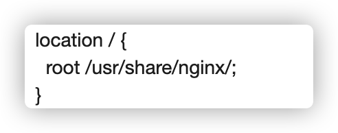
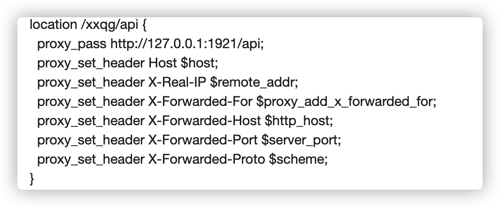
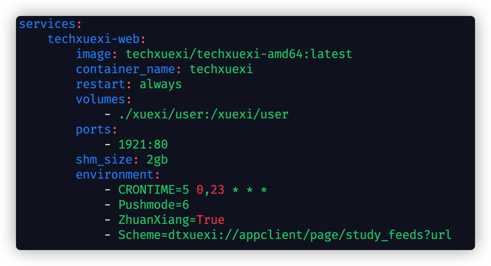

# TechXuexiWeb
 对某开源学习软件前端进行改版，进行部分功能上的精简和优化。

所精简和优化的内容并不适合大众，因此没有直接提交回原仓库，自建仓库维护，仅供个人学习使用。

## 优化内容：

1. 增加各种按钮点击后的提示、加载动画
2. 将页面放在main.html并用index.html进行中转跳转，方便在CDN中进行缓存设置
3. js文件放在本地而不是使用bootcdn(bootcdn有时候崩了，不如放在自己本地稳定，更何况自己有cdn)
4. 适配手机移动端页面
5. 将按钮功能优化为仅有登录和刷新状态
6. 删除其余一些介绍，修改一些描述
7. 对登录跳转进行细分，电脑提示用手机登录；非本地浏览器（QQ、微信内）提示用浏览器打开；本地浏览器跳转到学习强国

## PS

仅在docker版测试，使用nginx进行转发，避免使用ip:端口的形式

修改的文件主要涉及于main.html、js/new.js、css、js/promptBox

我将修改后的静态文件直接放在nginx的xxqg目录下

api端口转发到设置的docker端口

访问ip/xxqg/即可完美使用

